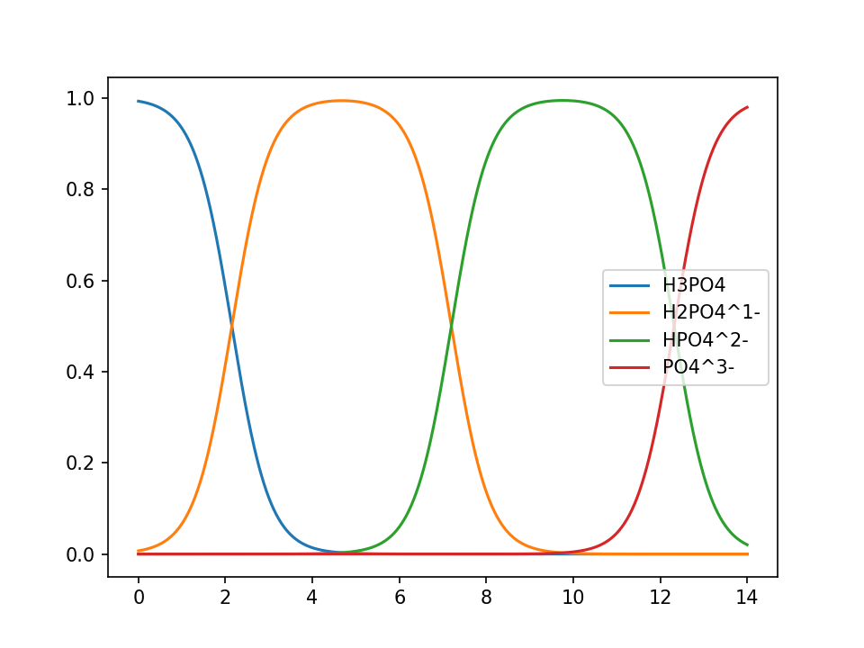
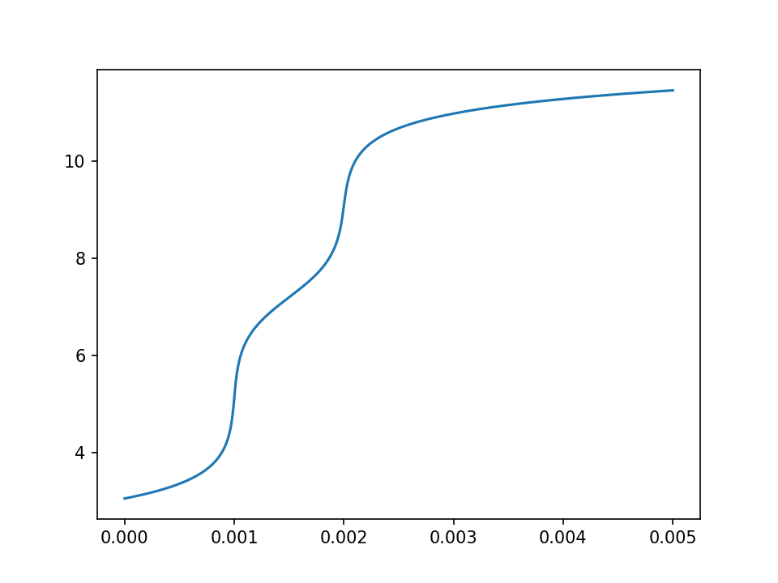

pHcalc
######

*pHcalc* is a Python library for systematic calculations of solution pH,
distribution diagrams, and titration curves.

This package is Python3 compatible with dependencies_ only on Numpy and
Scipy. If you will be plotting the data, then there is an `optional
dependency`_ on Matplotlib as well.  

.. _dependencies:

Dependencies
------------

* Numpy >= 1.10

* Scipy >= 0.17

.. _optional dependency:

Optional Packages
-----------------

* Matplotlib >= 1.5

Installation
------------

*pHcalc* is available via ``pip``, ``conda``, or the `GitHub repo`_ (most
recent).

From PyPI::

    $ pip install pHcalc

Via Conda::

    $ conda install -c rnelsonchem phcalc

If you have ``git`` installed on your system, then you can get the most
recent, unrelased version from the `GitHub repo`_::

    $ pip install git+https://github.com/rnelsonchem/pHcalc.git

Background
##########

*pHcalc* calculates the pH of a complex system of acids and bases using a
systematic equilibrium solution method. This method is described in detail in
`the Journal of Chemical Education`_ and in this `ChemWiki article`_, for
example. (There is also another, older Pascal program called PHCALC_, which
uses matrix algebra to accomplish the same task. To the best of my knowledge,
the source code for this program is no longer available.)

Basically, this method finds the equilibrium concentrations for the solution
by systematically adjusting the pH until a charge balance is achieved, i.e.
the concentrations of positively charged ions equals the charge for the
negatively charged ions.  For (polyprotic) weak acids, the fractional
distribution of the species at a given pH value is determined. Multiplying
this by the concentration of acid in solution provides the concentration of
each species in the system, and these concentrations are used to balance the
charge.

Defined Classes
###############

*pHcalc* defines three classes - Acid, Inert, and System - which are used in
calculating the pH of the system. |H3O| and |OH-| are never explicitly
defined; these concentrations are adjusted internally using K\ :sub:`W`\ .

.. code:: python

    >>> from pHcalc import Acid, Inert, System

The general definitions of these objects are given in the following list, with
detailed usage examples outlined in the examples_ section below. 

- ``Acid`` This class is used to define an aqueous species that has one or
  more known |Ka|/|pKa| values.

- ``Inert`` This class is used to define aqueous ions that are assumed to not
  be part of any aqueous equilibria. For example, |Na+| or |Cl-|.

- ``System`` This is a collection of ``Acid`` and ``Inert`` objects that
  define your aqueous solution. This class has a method for calculating the pH
  of this group of species.

.. _examples:

Example Usage
#############

The examples below are meant to demonstrate a variety of different usage cases
of the *pHcalc* classes described above. These example can be run from an
interactive terminal (including Jupyter notebooks) or from a '.py' file.
However, the following imports are assumed in every case.

.. code:: python

    >>> from pHcalc import Acid, Inert, System
    >>> import numpy as np
    >>> import matplotlib.pyplot as plt # Optional for plotting below

pH of 0.01 M HCl
----------------

This simple example can be calculated in two different ways using *pHcalc*,
which highlights the usage of all the defined object classes. 

Method 1
________

In the first method, the ``Acid`` class is used to define our acid HCl, as
shown in the code snippet below.

.. code:: python

    >>> hcl = Acid(pKa=-8., charge=0, conc=0.01, name='HCl')

For HCl, the given |pKa| is an estimate_, but it will work fine for our
purposes. The ``charge`` keyword is an integer used to define the charge for
the most acidic species. For HCl, the two possible species in solution are HCl
and |Cl-| -- the most acidic species, HCl, does not have a charge. The
``conc`` keyword argument sets the total molarity ([Total] = [HCl] + [|Cl-|])
of this acid in solution. The final (optional) keyword argument, ``name``, is
a string that can be used to set the name of this ``Acid`` for printing
purposes, as discussed below.

The ``System`` class is used to collect a group of ``Acid`` and ``Inert``
species for pH calculations. Any number of species instances can be passed in
as positional arguments during initialization. Printing this instance provides
some information about the species in solution. Notice that a warning is give
that lets us know the solution is not at equilibrium -- i.e. the pH has not
been calculated. A very important aspect of the code is that |H3O| and |OH-|
concentrations are not defined explicitly. 

.. code:: python

   >>> system = System(hcl)
   >>> print(system)

::

   ### THE CONCENTRATIONS OF THIS SYSTEM ARE NOT AT EQUILIBRIUM ###
   To determine the equilibrium species distribution use System.pHsolve
   
   Species        Charge    Ka             pKa       Conc
   =================================================================
   HCl            +0        1.000e+08      -8.00     1.0000e-02
   HCl            -1        nan            nan       0.0000e+00
   -----------------------------------------------------------------
   H3O+           +1                                 1.0000e-07
   OH-            -1                                 1.0000e-07

The ``pHsolve`` method can be used to calculate the equilibrium
concentrations, including pH. Printing the ``System`` instance again will now
show the pH and equilibrium concentrations. 

.. code:: python

   >>> system.pHsolve()
   >>> print(system)

::

    ### THESE ARE THE EQUILIBRIUM SYSTEM CONCENTRATIONS ###

    SYSTEM pH: 2.000

    Species        Charge    Ka             pKa       Conc
    =================================================================
    HCl            +0        1.000e+08      -8.00     1.0000e-10
    HCl            -1        nan            nan       1.0000e+00
    -----------------------------------------------------------------
    H3O+           +1                                 1.0000e-02
    OH-            -1                                 9.9999e-13

After running the ``pHsolve`` method, a new object attribute, ``pH``, is
created, which is the calculated pH value with full precision. 

.. code:: python

   >>> print(system.pH)
   1.9999977111816385

Method 2
________

An alternate method for determining the pH is to define a solution of chloride
(|Cl-|) ions. HCl is typically considered a strong acid in aqueous solutions,
because it is assumed that this molecule completely dissociates to equal
amounts of |H3O| and |Cl-|. Because *pHcalc* calculates the |H3O|
concentration internally, this species does not need to be included in the
``System`` call. Instead, we can define |Cl-| as an instance of the ``Inert``
object class. These objects are used to define aqueous ions that are assumed
to not directly participate in Bronsted-Lowry acid/base equilibria; however,
their presence in solution affects the overall charge balance of the solution.
Printing this system before equilibration shows an equal concentration of
"Chloride" and "|H3O|" (1.000e-02).

.. code:: python

    >>> cl = Inert(charge=-1, conc=0.01, name='Chloride')
    >>> system = System(cl)
    >>> print(system)

::

    ### THE CONCENTRATIONS OF THIS SYSTEM ARE NOT AT EQUILIBRIUM ###
    To determine the equilibrium species distribution use System.pHsolve

    Species        Charge    Ka             pKa       Conc
    =================================================================
    Chloride       -1                                 1.0000e-02
    -----------------------------------------------------------------
    H3O+           +1                                 1.0000e-02
    OH-            -1                                 1.0000e-12 

Equilibrating this system with the ``pHsolve`` method provides a solution with
the same pH value as our original solution using HCl.

.. code:: python

   >>> system.pHsolve()
   >>> print(system)

::

    ### THESE ARE THE EQUILIBRIUM SYSTEM CONCENTRATIONS ###

    SYSTEM pH: 2.000

    Species        Charge    Ka             pKa       Conc
    =================================================================
    Chloride       -1                                 1.0000e-02
    -----------------------------------------------------------------
    H3O+           +1                                 1.0000e-02
    OH-            -1                                 9.9999e-13

pH of 1e-8 M HCl
----------------

This is a notoriously tricky example for introductory chemistry students;
however, *pHcalc* handles it nicely.

.. code:: python

    >>> cl = Inert(charge=-1, conc=1e-8)
    >>> system = System(cl)
    >>> system.pHsolve()
    >>> print(system) # pH is 6.978 NOT 8!

::

    ### THESE ARE THE EQUILIBRIUM SYSTEM CONCENTRATIONS ###

    SYSTEM pH: 6.978

    Species        Charge    Ka             pKa       Conc
    =================================================================
    Chloride       -1                                 1.0000e-08
    -----------------------------------------------------------------
    H3O+           +1                                 1.0512e-07
    OH-            -1                                 9.5125e-08

pH of 0.01 M NaOH
-----------------

This example is very similar to our second HCl example, except that our Inert
species must have a positive charge. In the same manner as our HCl examples
above, the charge balance is achieved internally by the system using an
equivalent amount of |OH-|.

.. code:: python

    >>> na = Inert(charge=1, conc=0.01)
    >>> system = System(na)
    >>> system.pHsolve()
    >>> print(system.pH) # Should print 12.00000

pH of 0.01 M HF
---------------

Here we will use an Acid object instance to define the weak acid HF, which has
a |Ka| of 6.76e-4 and a |pKa| of 3.17. You can use either value when you
create the Acid instance. When defining an Acid species, you must always
define a ``charge`` keyword argument, which is the charge of the *fully
protonated species*.

.. code:: python

    >>> hf = Acid(Ka=6.76e-4, charge=0, conc=0.01)
    >>> # hf = Acid(pKa=3.17, charge=0, conc=0.01) will also work
    >>> system = System(hf)
    >>> system.pHsolve()
    >>> print(system.pH) # Should print 2.6413261

pH of 0.01 M NaF
----------------

This system consist of a 1:1 mixture of an HF Acid instance and a |Na+|
Inert instance. The System object can be instantiated with an arbitrary
number of Acids and Inert objects. Again, there is an implied equivalent of
|OH-| necessary to balance the charge of the system.

.. code:: python

    >>> hf = Acid(Ka=6.76e-4, charge=0, conc=0.01)
    >>> na = Inert(charge=1, conc=0.01)
    >>> system = System(hf, na)
    >>> system.pHsolve()
    >>> print(system.pH) # Should print 7.5992233

pH of 0.01 M |H2CO3|
--------------------

The |Ka| and |pKa| attributes also accept lists of values for polyprotic
species.

.. code:: python

    >>> carbonic = Acid(pKa=[6.35, 10.33], charge=0, conc=0.01)
    >>> system = System(carbonic)
    >>> system.pHsolve()
    >>> print(system.pH) # Should print 4.176448

pH of 0.01 M Alanine Zwitterion Form
------------------------------------

Alanine has two pKa values, 2.35 and 9.69, and the fully protonated form is
positively charged. In order to define the neutral zwitterion, a ``System``
containing only the positively charged ``Acid`` object needs to be defined.
The charge balance in this case implies a single equivalent of |OH-|, as can
be seen by printing the ``System`` instance before calculating the pH.

.. code:: python 

    >>> ala = Acid(pKa=[2.35, 9.69], charge=1, conc=0.01)
    >>> system = System(ala)
    >>> print(system)

::

    ### THE CONCENTRATIONS OF THIS SYSTEM ARE NOT AT EQUILIBRIUM ###
    To determine the equilibrium species distribution use System.pHsolve

    Species        Charge    Ka             pKa       Conc
    =================================================================
    Acid1          +1        4.467e-03      2.35      1.0000e-02
    Acid1          +0        2.042e-10      9.69      0.0000e+00
    Acid1          -1        nan            nan       0.0000e+00
    -----------------------------------------------------------------
    H3O+           +1                                 1.0000e-12
    OH-            -1                                 1.0000e-02

.. code:: python

    >>> system.pHsolve()
    >>> print(system)

::

    ### THESE ARE THE EQUILIBRIUM SYSTEM CONCENTRATIONS ###

    SYSTEM pH: 6.099

    Species        Charge    Ka             pKa       Conc
    =================================================================
    Acid1          +1        4.467e-03      2.35      1.7810e-04
    Acid1          +0        2.042e-10      9.69      9.9957e-01
    Acid1          -1        nan            nan       2.5643e-04
    -----------------------------------------------------------------
    H3O+           +1                                 7.9587e-07
    OH-            -1                                 1.2565e-08

In practice, though, a solution of this species would be created by dissolving
the commercially available HCl salt of alanine (Ala*HCl) in water and adding
an equimolar amount of NaOH to free the base. This situation can be easily
accomplished by adding ``Inert`` instances for |Cl-| and |Na+|; the result of
this pH calculation is equivalent to before. (Note: the ionic strength of this
solution will be quite a bit different, though.)

.. code:: python

    >>> ala = Acid(pKa=[2.35, 9.69], charge=1, conc=0.01)
    >>> cl = Inert(charge=-1, conc=0.01, name='Chloride')
    >>> na = Inert(charge=1, conc=0.01, name='Sodium')
    >>> system = System(ala, cl, na)
    >>> system.pHsolve()
    >>> print(system)

::

    ### THESE ARE THE EQUILIBRIUM SYSTEM CONCENTRATIONS ###

    SYSTEM pH: 6.099

    Species        Charge    Ka             pKa       Conc
    =================================================================
    Acid1          +1        4.467e-03      2.35      1.7810e-04
    Acid1          +0        2.042e-10      9.69      9.9957e-01
    Acid1          -1        nan            nan       2.5643e-04
    -----------------------------------------------------------------
    Chloride       -1                                 1.0000e-02
    -----------------------------------------------------------------
    Sodium         +1                                 1.0000e-02
    -----------------------------------------------------------------
    H3O+           +1                                 7.9587e-07
    OH-            -1                                 1.2565e-08

pH of 0.01 M |NH4PO4|
---------------------

This is equivalent to a 1:3 mixture of |H3PO4| and |NH4|, both of which are
defined by Acid objects. Three equivalents of |OH-| are implied to balance the
charge of the system.

.. code:: python

    >>> phos = Acid(pKa=[2.148, 7.198, 12.319], charge=0, conc=0.01)
    >>> nh4 = Acid(pKa=9.25, charge=1, conc=0.01*3)
    >>> system = System(phos, nh4)
    >>> system.pHsolve()
    >>> print(system.pH) # Should print 8.95915298

Distribution Diagrams
---------------------

Acid objects also define a function called ``alpha``, which calculates the
fractional distribution of species at a given pH. This function can be used to
create distribution diagrams for weak acid species. ``alpha`` takes a single
argument, which is a single pH value or a Numpy array of values. For a single
pH value, the function returns a Numpy array of fractional distributions
ordered from most acid to least acidic species. 

.. code:: python

    >>> phos = Acid(pKa=[2.148, 7.198, 12.319], charge=0, conc=0.01)
    >>> phos.alpha(7.0)
    array([ 8.6055e-06, 6.1204e-01, 3.8795e-01, 1.8611e-06])
    >>> # This is H3PO4, H2PO4-, HPO4_2-, and PO4_3-

For a Numpy array of pH values, a 2D array of fractional distribution values
is returned, where each row is a series of distributions for each given pH.
The 2D returned array can be used to plot a distribution diagram. 

.. code:: python

    >>> phos = Acid(pKa=[2.148, 7.198, 12.319], charge=0, conc=0.01)
    >>> phs = np.linspace(0, 14, 1000)
    >>> fracs = phos.alpha(phs)
    >>> plt.plot(phs, fracs)
    >>> plt.legend(['H3PO4', 'H2PO4^1-', 'HPO4^2-', 'PO4^3-'])
    >>> plt.show()

Titration Curves
----------------

Using a simple loop, we can also construct arbitrary titration curves as well.
In this example, we will titrate |H3PO4| with NaOH. The ``guess_est`` keyword
argument for the ``System.pHsolve`` method forces the calculation of a best
guess for starting the pH optimization algorithm. This may speed up the
evaluation of the pH and can also be used if the minimizer throws an error
during the pH calculation. 

.. code:: python

    >>> na_moles = np.linspace(1e-8, 5.e-3, 500)
    >>> sol_volume = 1. # Liter
    >>> phos = Acid(pKa=[2.148, 7.198, 12.375], charge=0, conc=1.e-3)
    >>> phs = []
    >>> for mol in na_moles:
    >>>     na = Inert(charge=1, conc=mol/sol_volume)
    >>>     system = System(phos, na)
    >>>     system.pHsolve(guess_est=True)
    >>>     phs.append(system.pH)
    >>> plt.plot(na_moles, phs)
    >>> plt.show()

.. Substitutions

.. |Na+| replace:: Na\ :sup:`+`
.. |Cl-| replace:: Cl\ :sup:`-`
.. |H3O| replace:: H\ :sub:`3`\ O\ :sup:`+`
.. |OH-| replace:: OH\ :sup:`-`
.. |H2CO3| replace:: H\ :sub:`2`\ CO\ :sub:`3`
.. |NaHCO3| replace:: NaHCO\ :sub:`3`
.. |Ka| replace:: K\ :sub:`a`
.. |pKa| replace:: pK\ :sub:`a`
.. |NH4PO4| replace:: (NH\ :sub:`4`\ )\ :sub:`3`\ PO\ :sub:`4`
.. |H3PO4| replace:: H\ :sub:`3`\ PO\ :sub:`4`
.. |NH4| replace:: NH\ :sub:`4`\ :sup:`+`

.. External Hyperlinks

.. _GitHub repo: https://github.com/rnelsonchem/pHcalc
.. _PyPI: https://pypi.python.org/pypi/pHcalc
.. _the Journal of Chemical Education:
      http://pubs.acs.org/doi/abs/10.1021/ed100784v
.. _ChemWiki article: 
    http://chemwiki.ucdavis.edu/Core/Analytical_Chemistry/Analytical_Chemistry_2.0/06_Equilibrium_Chemistry/6G%3A_Solving_Equilibrium_Problems#6G.3_A_Systematic_Approach_to_Solving_Equilibrium_Problems
.. _PHCALC: http://pubs.acs.org/doi/pdf/10.1021/ed071p119
.. _estimate: https://organicchemistrydata.org/hansreich/resources/pka/pka_data/evans_pKa_table.pdf

